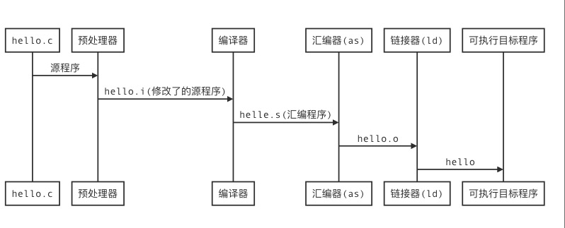

# 计算机系统漫游

源程序实际就是一个由值0和1组成的位（又称比特）序列，8个位被组成一组称为字节。

##  hello world

```c
#include <stdio.h>
int main(){
  printf("hello, world\n");
  return 0;
}
```

通过gcc编译器驱动程序编译hello world 程序了解编译器阶段流程

``` sequence
hello.c->预处理器:源程序
预处理器->编译器:hello.i(修改了的源程序)
编译器->汇编器(as):helle.s(汇编程序)
汇编器(as)->链接器(ld):hello.o
链接器(ld)->可执行目标程序:hello

```




预处理阶段： #include <stdio.h> 中的stdio.h 文件添加到插入程序文本输出.i文件拓展名的文本 （如果有很多个include 文件是不是会变得巨大？）

编译阶段： 将程序编译汇编语言程序

汇编阶段：汇编翻译成机器语言指令保存为二进制文件

链接阶段： 将程序中内置函数如printf  已经预编译好的二进制文件合并到文件中输出可执行文件。


## 硬件

硬件组成：

+ 总线 

  + 主板

  + 总线中传送的定长的字节块，也就是字（word）,定长的字节数 4 个字节就是传说中的32位， 定长的字节数 8个字节就是传说中的64位。

+ i/o 设备

  + 鼠标 键盘 显示器

+ 主存

  + 内存条

+ 处理器

  + Intel 
  + AMD  

**AMD YES**

系统花费的大量的时间吧信息从一个地方挪到另一个地方。 --引入缓存概念。了解了CPU参数上的三级缓存是干啥的，又能愉快的装机了。

##  操作系统

基本功能

1. 防止硬件被失控的应用程序滥用
2. 向应用程序提供简单一致的机制来控制复杂而又通常大不相同的低级硬件设备

+ 进程
  + CPU 看上去并发执行地多个应用程序，实际上是进程之间来回切换，这种来切换的机制称为**上下文切换**
+ 线程
  + 一个进程实际是由多个线程的执行单元组成
+ 虚拟内存
  +  堆，栈， 内存溢出
+ 文件
  + I/O 

## Amdahl 定律

```scheme
(define (speed α k)
  (/ 1 (+ (- 1 α) (/ α k))
     ))
```

**推导这个公式花了几个小时。。。。数学能力。。。。**

这个定律感觉可以作为程序迭代一个一个量化标准。


## 小结

计算机是由邮件和系统软件组成，共同协作运行应用程序。

**计算机中抽象是和很重要的**：  文件是对I/O设备的抽象； 虚拟内存是内存和磁盘的抽象；进程是处理器、内存、I/O设备的抽象。
